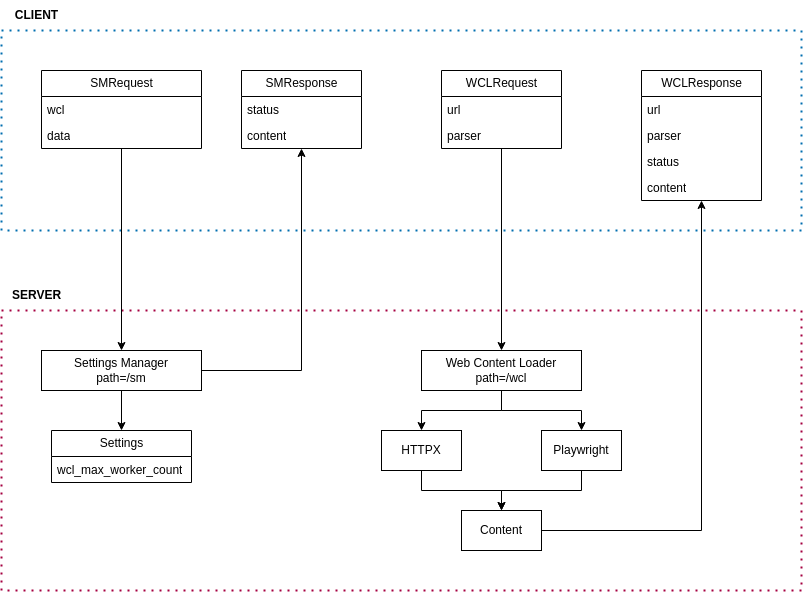

<p align="center"></p>

Server
```bash
uv run python src/server.py
# Serving on ('0.0.0.0', 8888)
```

API Example
```
GET http://0.0.0.0:8888/wcl?url=<url>
```

Test with Client
```bash
uv run python -m http.server --directory data
uv run python src/client.py [asyncio,httpx]
# Received: 121 bytes.
# Received: 138 bytes.
```
